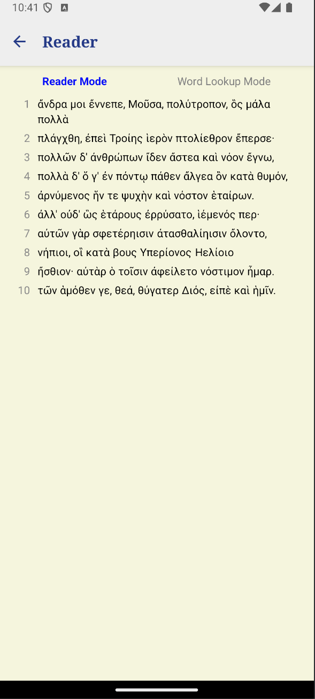

# Perseus

Perseus is a mobile-friendly app inspired by the Scaife Viewer. It aims to provide a simple user experience for accessing and reading various ancient texts and provide a simple and easy interface to analyse and read content from different languages.

## Features

- Mobile-friendly design for easy access on smartphones and tablets.
- Access to a wide range of open source ancient texts and various foreign language material.
- Simple and intuitive user interface.
- (Coming soon - Integrate AI to in concert to build a custom learning plan and progress through different source texts)

## Prerequisites

This project used Expo and React Native. To compile it, you will need to install NPM, NodeJS, Expo, React Native, and have some kind of device or simulator to run the compiled app.

## Getting Started

To get started with Perseus, follow these steps:

1. Clone the repository: `git clone https://github.com/ConflictingTheories/perseus.git`
2. Install the required dependencies: `npm install`
3. Start the development server: `npx expo start`

## Contributing

Contributions are welcome! If you'd like to contribute to Perseus, please follow these guidelines:

1. Fork the repository.
2. Create a new branch for your feature or bug fix.
3. Make your changes and commit them.
4. Push your branch to your forked repository.
5. Submit a pull request.

## License

This project is licensed under the [MIT License](LICENSE).

## Contact

If you have any questions or suggestions, feel free to reach out to me.

## Screenshot

