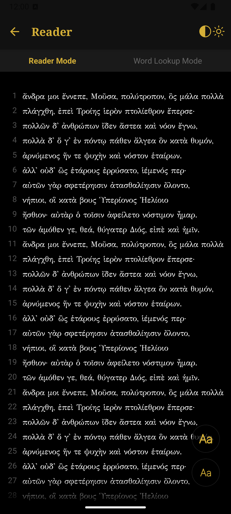

# Logios - Literary Mobile Reader

Logios (Perseus Mobile) is a mobile-friendly app inspired by the Scaife Viewer. It aims to provide a simple user experience for accessing and reading various ancient texts and provide a simple and easy interface to analyse and read content from different languages.

## Features

- Mobile-friendly design for easy access on smartphones and tablets.
- Access to a wide range of open source ancient texts and various foreign language material.
- Simple and intuitive user interface.
- (Coming soon - Integrate AI to in concert to build a custom learning plan and progress through different source texts)

## Prerequisites

This project used Expo and React Native. To compile it, you will need to install NPM, NodeJS, Expo, React Native, and have some kind of device or simulator to run the compiled app.

## Getting Started

To get started with Logios (Perseus Mobile), follow these steps:

1. Clone the repository: `git clone https://github.com/ConflictingTheories/perseus.git`
2. Install the required dependencies: `npm install`
3. Start the development server: `npx expo start`

## Contributing

Contributions are welcome! If you'd like to contribute to Logios, please follow these guidelines:

1. Fork the repository.
2. Create a new branch for your feature or bug fix.
3. Make your changes and commit them.
4. Push your branch to your forked repository.
5. Submit a pull request.

### LICENSE

 This work is licensed under a <a rel="license" href="http://creativecommons.org/licenses/by-nc/4.0/">Creative Commons Attribution-NonCommercial 4.0 International License</a>.

This plugin is free to use for non-commercial use only. If you are an individual, a hobbyist, or a tinkerer than this is free to use for your personal use excluding any commercial use. All modifications to the source code must be released back as open source to the community and preferably a pull request will be made with the available updates and improvements if applicable. There is commercial licensing available upon an individual request basis. The licensing will be based upon the scope and revenue expectations of the commercial use-case. For more information, please reach out via email to director@sovereign.enterprises for licensing details. For more information on the non-commerical license which is included by default - please see [LICENSE](LICENSE)

## Contact

If you have any questions or suggestions, feel free to reach out to me. Or visit (https://sovereign-research.com)

## Screenshot

